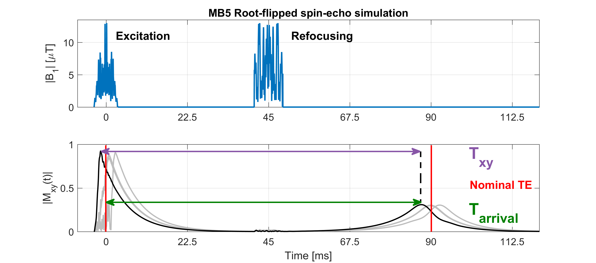
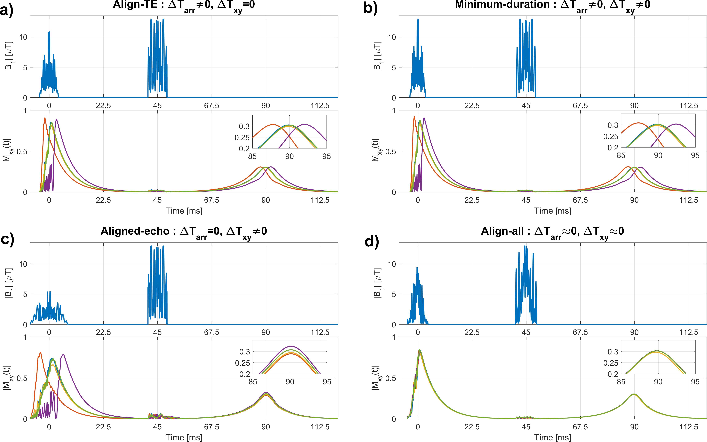
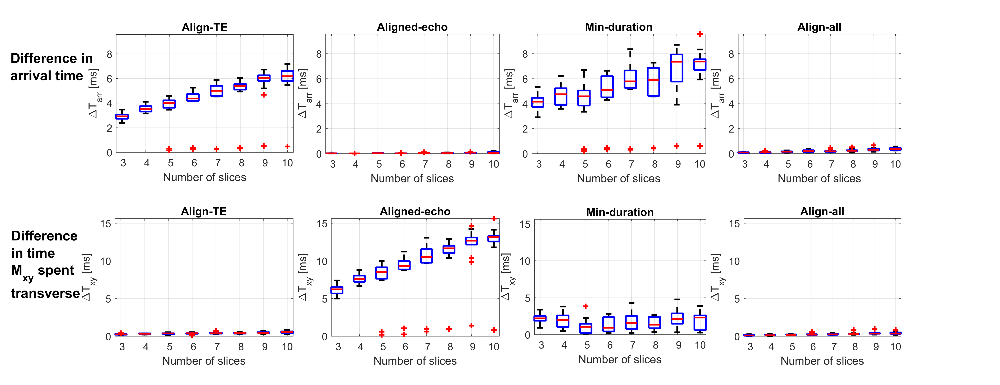

# Root-flipped multiband pulses with inherently aligned echoes
(As presented at ISMRM 2017 Honolulu, Hawaii. Abstract nr 3955)
Download Abstract and ePoster from [here](https://kclpure.kcl.ac.uk/portal/en/publications/rootflipped-multiband-pulses-with-inherently-aligned-echoes(4cea6aef-4143-4f76-b75d-72ddebf7abd2).html).

Root-flipped Multiband refocusing RF pulses as proposed by Sharma et al (MRM 2016) are more time-efficient pulses compared to pulses designed by phase-optimization (Wong 2012) and time-shifting (Auerbach 2013). However, this has been achieved by exciting different slices at different times during the RF pulse.
A consequence of this is that when Root-flipped pulses are used in a spin-echo pair, different slices will also form a spin-echo at different times. This is shown below.

This can be problematic for a single-shot EPI acquisition, where you want to cross the center of k-space at the peak of the echo-formation (i.e. at "Nominal TE"). In reality, you'd probably still acquire all the echoes at the nominal TE, but this means that different slices will be possibly be measured with different T2 and T2-star weighting. 

We've identified two parameters that matter:
* T-xy - The time the slice has spent being transverse, which will determine its T2-weighting 
* T-arrival - The time between the center of nominal excitation and peak of the spin-echo formation. This will determine the disparity of T2-star weighting.

In this work we've made two contributions:
* Solving the Bloch equations, we've simulated these spin-echoes for a range of Multi-band factors to see what disparities in T-xy and T-arrival we can expect.
* Provide a modified root-flipped technique which inherently aligns all the echoes. This means that spin-echoes reach their peak almost simultaneously (thus having minimal T2-star disparity), and spend almost equal time being transeverse (thus having negligible difference in their T2 weighting).

Auerbach (MRM 2013) and Sharma (MRM 2016) already identified three excitation methods (Align-TE, Aligned-echo and minimum duration) which circumvent this issue in different way. Below is a comparison, showing that only the inherently aligned method fully aligns the echoes:

The expected disparity from Bloch simulation (presented in milli-seconds) for different Multi-band factors:

This code was further developed from the code released by Sharma et al for the root-flipping publication, which is available at:
http://www.vuiis.vanderbilt.edu/~grissowa/
This package requires the following:
*  CVX from (http://cvxr.com/cvx/).
*  Pauly's RF tools from (http://rsl.stanford.edu/research/software.html).
  

Other things that MRI physicists might find useful:
* The repo includes a script and a Bloch-simulators which is able to simulate B0-inhomogeniety (i.e. spin-dephasing due to spin-spin interactions) 
based on Adult brain white matter at 3T.
* For those working in Simultaneous Multi-Slice (SMS) Imaging, the repo also includes a function which for a multiband spin-echo (excitation + refocusing) calculates the gradient rewind area which minimizes the maximum possible in-slice phase error in radians using an fminsearch approach.

11/04/2017
Updated 03/10/2017
For contact:
Samy Abo Seada
samy.abo_seada@kcl.ac.uk

Shaihan Malik
shaihan.malik@kcl.ac.uk
King's College London, 2017.